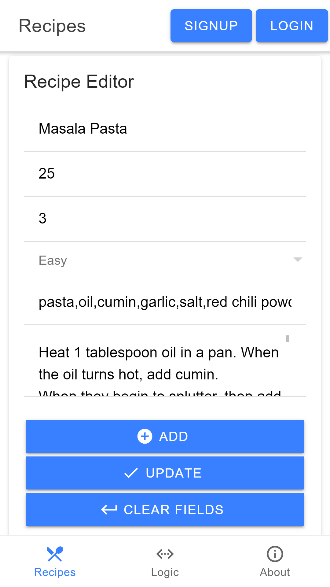
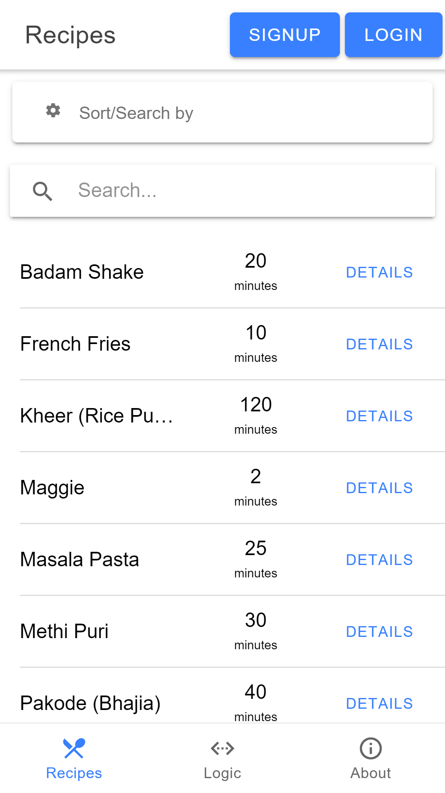
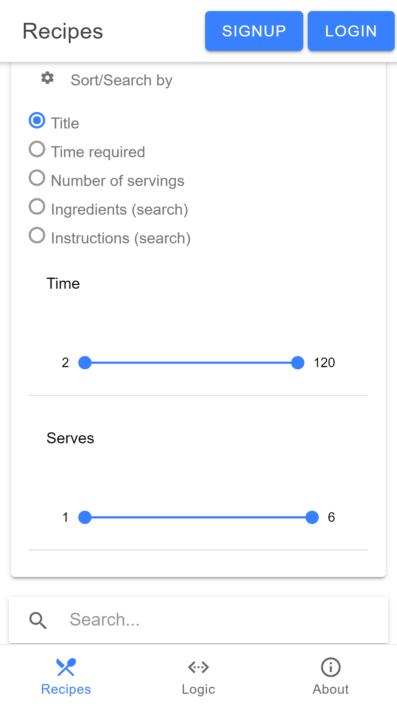
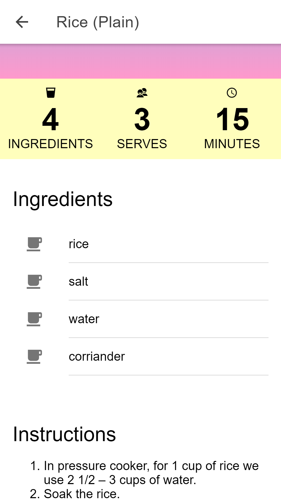
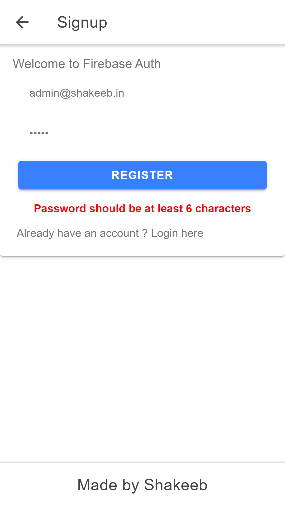
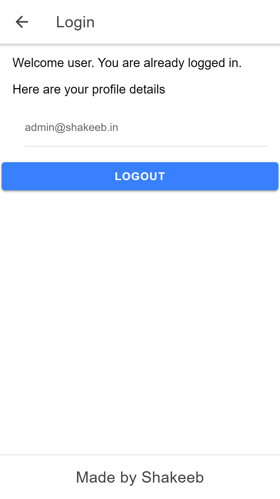
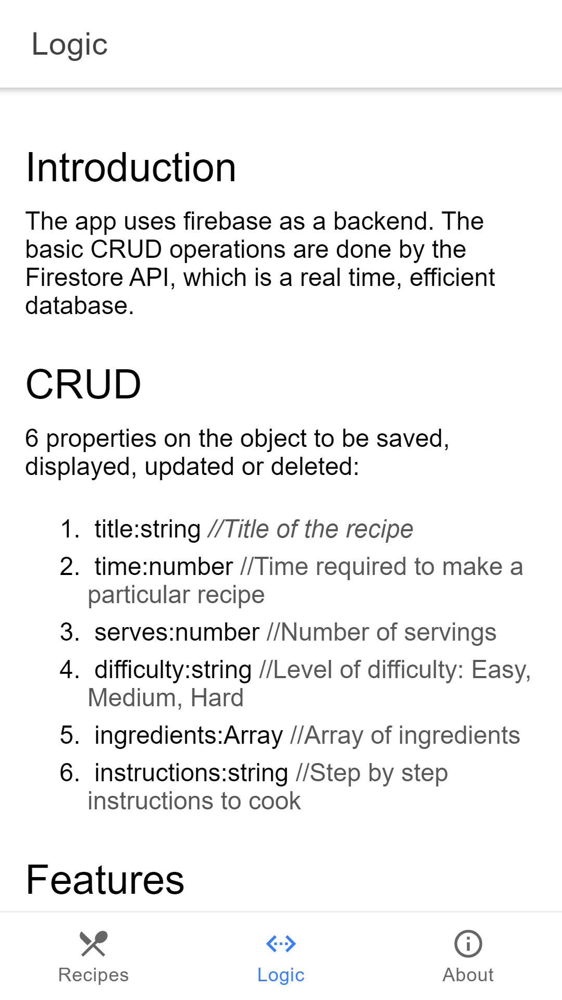
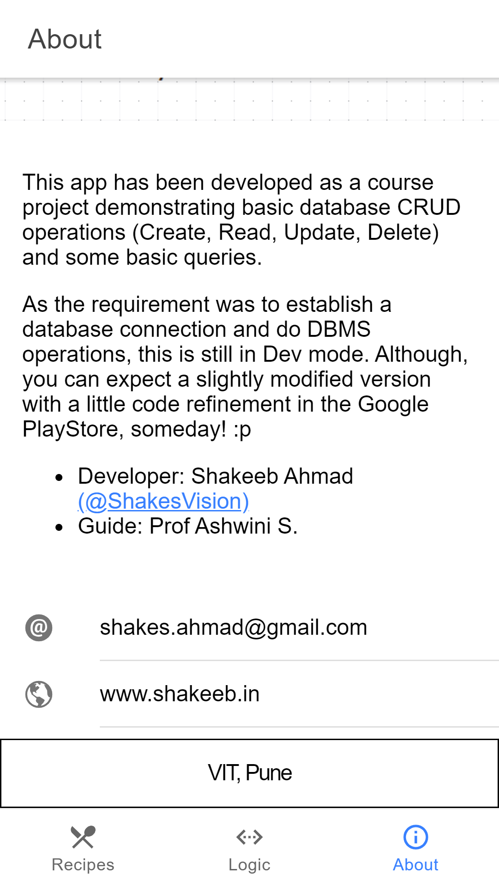

## About

This app has been developed as a course project demonstrating basic database CRUD operations (Create, Read, Update, Delete) and some basic queries.

As the requirement was to establish a database connection and do DBMS operations, this is still in Dev mode. Although, you can expect a slightly modified version with a little code refinement in the Google PlayStore, someday! :p

Finished: 14/11/2019

*   Developer: Shakeeb Ahmad [(@ShakesVision)](https://t.me/ShakesVision)
*   Guide: Prof Ashwini S.

shakes.ahmad@gmail.com | www.shakeeb.in

VIT, Pune

## Screenshots

